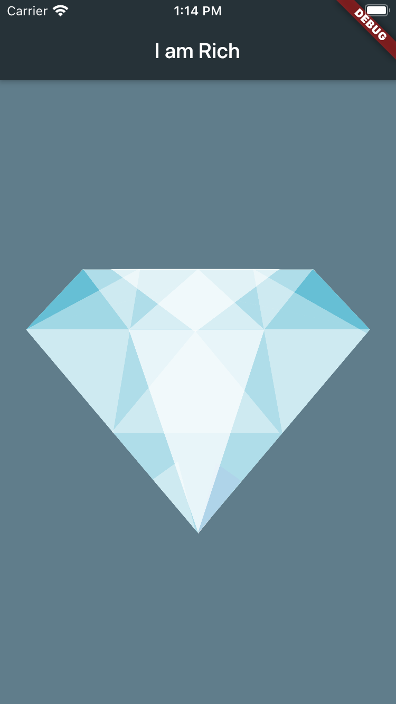

# i_am_rich

This is a basic flutter app created for learning material design.

## How the app works?

This is just a basic app created just to illustrate how the flutter is used to create apps.

The app is shown below



Here it is clear that it is a simple app that incorporates flutter

```dart
void main() => runApp();
```
The runApp thus takes a widget which in turns takes another widget untill the app has been created
```dart
MaterialApp(
    home:Scaffold(),//it is the pallete on which the app is drawn
);//it provides the basic material design to create a app
```

The app follows the widget tree


